# Introduction

This MVP web application will showcase the possibility of having webapp to standardise MSISDNs (Telephone numbers) to E164 format (e.g. +447912345678) which is compatible with other corporate systems. This will ensure matching entites is done consistently with the highest chance of success.

# Table of Contents
- [`Installation`](#Installation)
- [`Usage`](#Usage)
- [`Contributing`](#Contributing)
- [`License`](#License)

# Installation
This application consists of HTML and Javascript with static unit tests completed in a jest framework.

# Usage
The code can be run using github pages or cloning the repository in vscode and using live server extenstion to run the page.

# Design
The wire frame for the webapp was designed and prototyped in Figma. This allowed for the app to be designed and shown to customers, allowing for instant feedback around design and the flow of the app. Initially I had designed an app with separate input and results pages. Customer feedback from the design stage said this was unnecessary as they wanted to see the RAW and standardised together, but didnt want to export the RAW at the end. This allowed for a more streamlined codebase and less HTML pages. As the app becomes more complex, extra pages may be required.

[Figma wireframe URL] (https://www.figma.com/file/Z6HpTQU05zg2OTryS5L4AR/SA1?type=design&node-id=0%3A1&mode=design&t=X9lGazhlGBTKNXYi-1)

Below are screenshots of the prototype:

The home page which the user first goes to allowing them to record their username and the task they are using the app for. This is for both audit and performance statistics collection purposes.
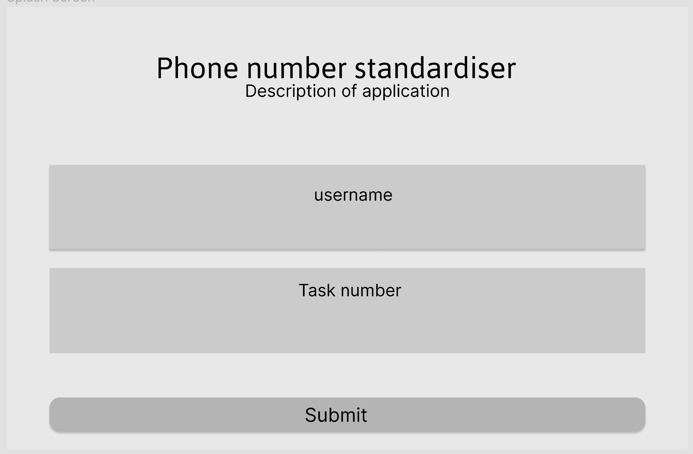

This si the page where the user can type in a list of new line separated MSISDNs or ingest a single column .csv or .txt file

This is the output for the app, a list of standardised numbers copied to clipboard.
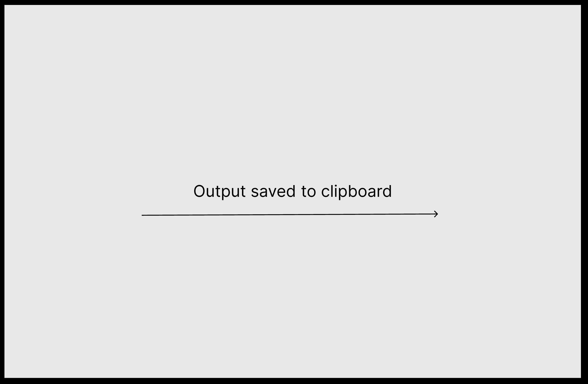

# Planning
This project was being developed using an agile framework using kanban. Kanban was chosen as I did not want a time scale, as would be required for a sprint, but needed to manage the tickets on the board. Kanban also allowed me to track the Work In Progress (WIP) and ensure too many tickets weren't being brought into the 'in progress' section of the board.

# Minimal Viable Product (MVP) development

# Testing

A test driven development approach was used throughtout the development of the MVP. 

By using a modern IDE, visual studio, static testing is completed on the go with alerts for Syntax, standards violations, and undefined values or variables. This is the foundation for my testing process during software development. For the most important function standardisingMsisdns I created a unit test with the expected results prior to writing the function. This was to ensure the function performed as required. When errors were found in the function they could be fixed immediately whilst writing the function and all possible outcomes could be captured and dealt with whilst writing the function. To perform static unit tests the jest framework was used. It’s a popular JavaScript framework which includes a runner and assertion library which are used in the unit tests. This framework allows me to group unit tests and run all the tests as part of a single group of tests. This static testing was completed alongside defensive coding of ensuring datatypes entering the functions was as expected and if not throwing an error. This ensures errors are dealt with early so as not to cause an issue later on in the function where outcomes would be less predictable for error catching.
To track manual testing of the code, a test and trace table has been completed to show the tests completed during development, the expected and actual outcomes and fixes deployed if required.

| Test ID | Test Description                                                                                                        | Expected Outcome                                                                                                                | Actual Outcome                                                                                                                     | Fix Deployed                                                                                                         |
|---------|-------------------------------------------------------------------------------------------------------------------------|---------------------------------------------------------------------------------------------------------------------------------|------------------------------------------------------------------------------------------------------------------------------------|----------------------------------------------------------------------------------------------------------------------|
| 1       | Initial skeleton of HTML file running on live server                                                                    | Text of ‘initial commit’ showing                                                                                                | 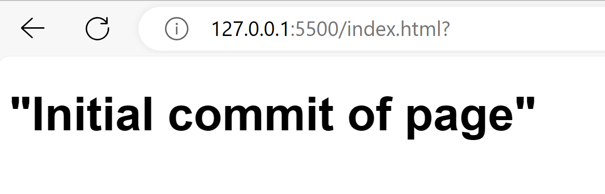                                                                                                      |                                                                                                                      |
| 2       | Initial skeleton of HTML file running on live server                                                                    | Text of ‘initial commit’ showing in a new font style                                                                            | 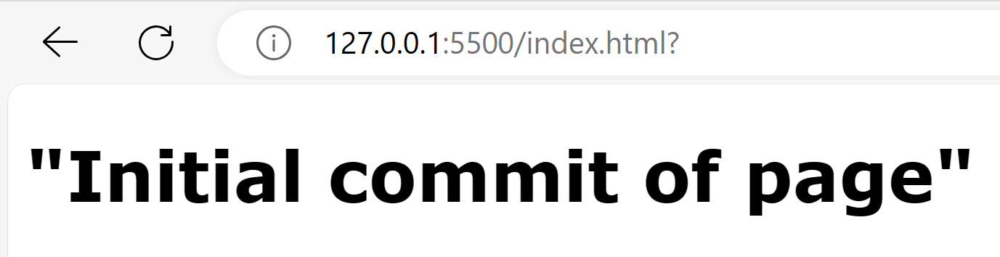                                                                                                      |                                                                                                                      |
| 3       | Add function to test both audit boxes have been completed.     Don’t complete any boxes.                                | Error message should appear                                                                                                     | No message and no navigation to index page.                                                                                        | '' Needed to be added to home.html to define where the js functions could be found. |
| 4       | Add function to test both audit boxes have been completed.     Don’t complete any boxes.                                | Error message as boxes empty                                                                                                    | 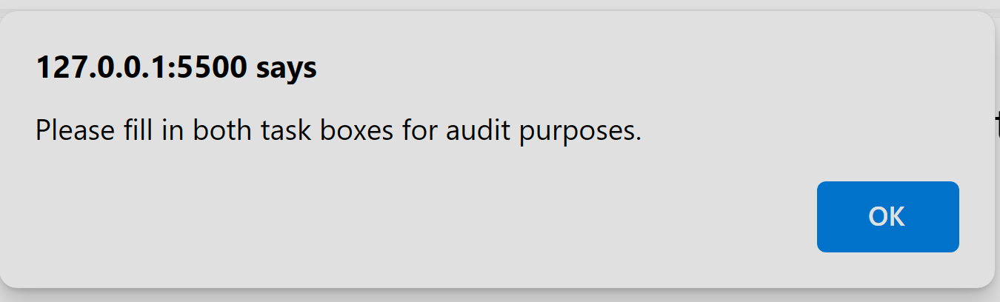                                                                                                      |                                                                                                                      |
| 5       | Add function to test both audit boxes have been completed.     complete a single box.                                   | Error message as one box is empty                                                                                               |                                                                                                       |                                                                                                                      |
| 6       | Add function to test both audit boxes have been completed.     complete both boxes.                                     | Navigation to index page with no error message                                                                                  | Navigation to index page with no error message                                                                                     |                                                                                                                      |
| 7       | Setup jest for unit tests                                                                                               | The below unit test should run and pass. 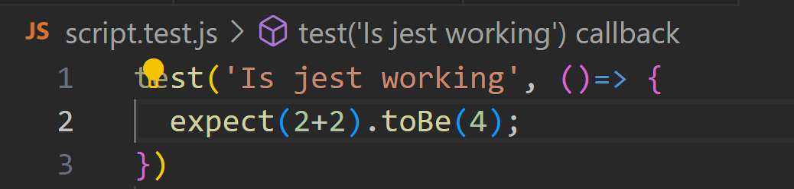                                                          | 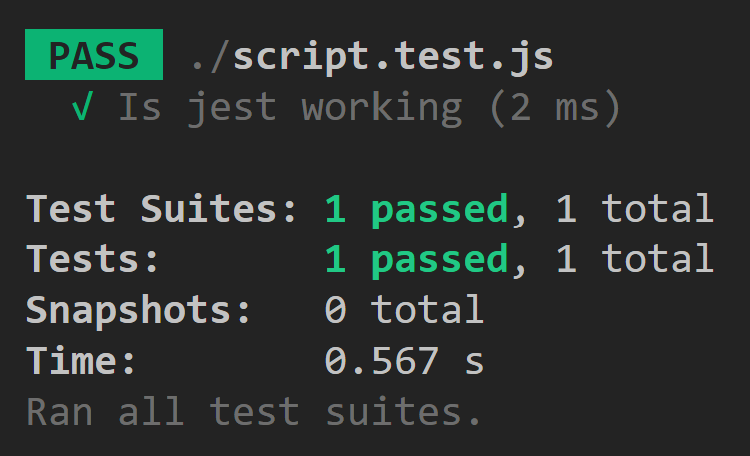                                                                                                      |                                                                                                                      |
| 8       | Create empty function block and ensure being seen by jest                                                               | Test should pass. 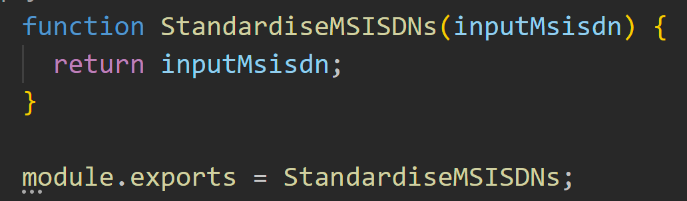                                                                                 | Test failed as jest was unable to identify function. 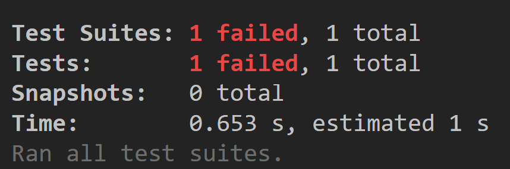                                                 | Fix was to ensure module was exported in scripts.js to expose it for testing                                         |
| 9       | Create empty function block and ensure being seen by jest                                                               | Test should pass.                                                                                  |                                                                                                                                    |                                                                                                                      |
| 10      | Run test to ensure failure on msisdn parsing as function not yet created                                                | Function should fail as the algorithms for standardising the msisdns are not yet in place.                                      | 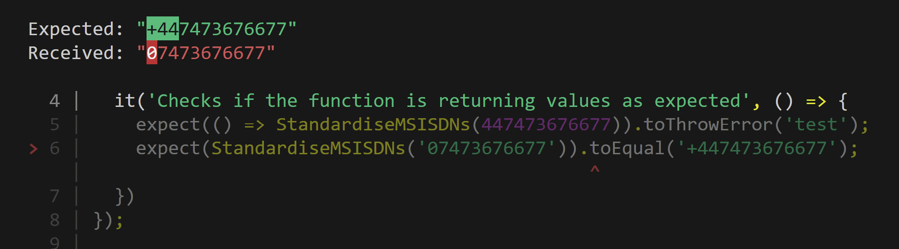                                                                                                    |                                                                                                                      |
| 11      | Integration testing for standardisingMsisdn function with the rest of script.js                                         | Function should fail as the algorithms for standardising the msisdns are not yet in place.                                      | 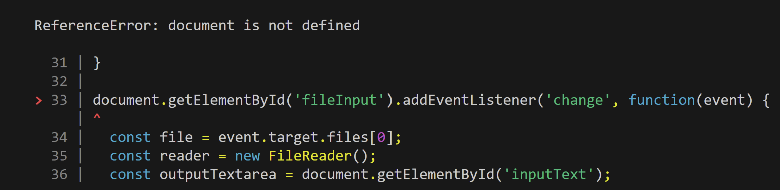. Code is outside a function and not running on a web browser therefore is being raised as an error | wrap code into a function or move web related listener code to a new .js file                                        |
| 12      | Integration testing for standardisingMsisdn function with the rest of script.js                                         | Function should fail as the algorithms for standardising the msisdns are not yet in place.                                      |                                                                                                     |                                                                                                                      |
| 13      | Test if when submit button is clicked variables are collected from the input box processed and output to the output box | 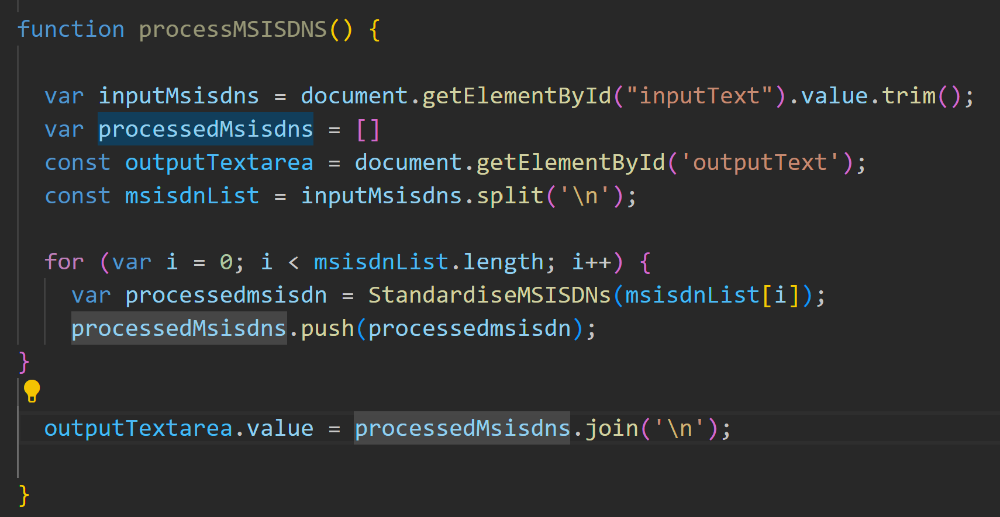 Function should copy the numbers to the output box as the standardise function is a shell still | 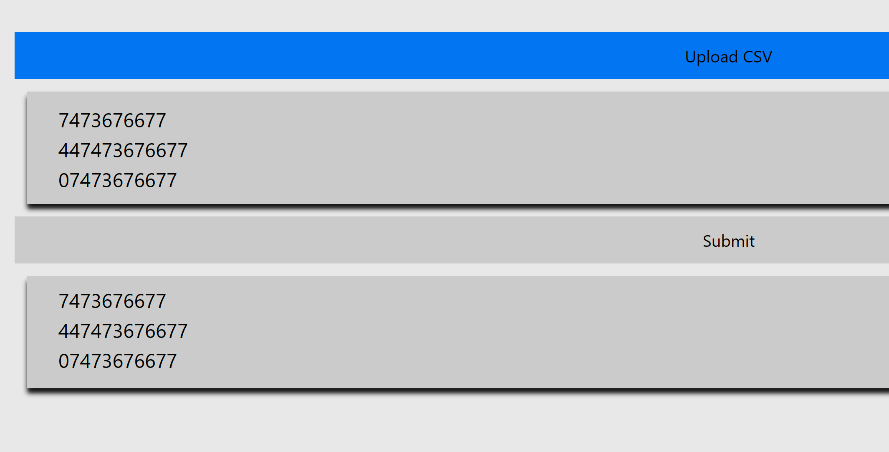                                                                                                    |                                                                                                                      |
| 14      | Test if input msisdns are standardised when submit is clicked                                                           | all msisdns appear in the output text box in a standardised form                                                                | 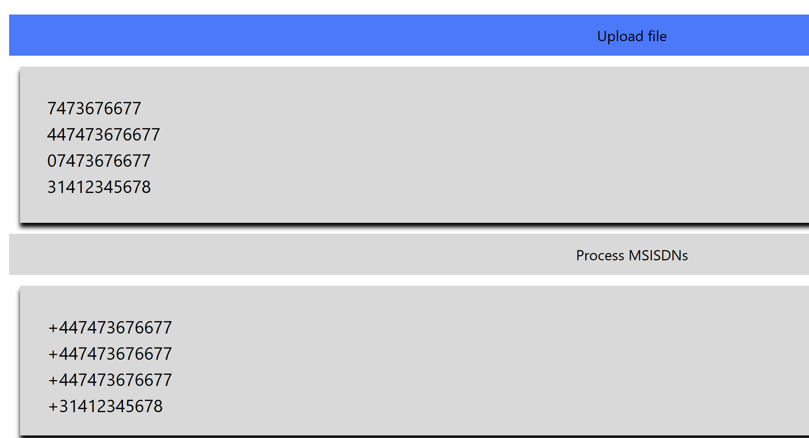                                                                                                    |                                                                                                                      |
| 15      | Test if output textbox contents are copied when copy button is clicked                                                  | I should be able to paste contents of output box to text file                                                                   | 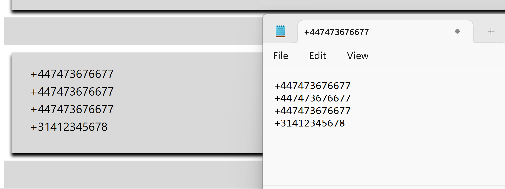                                                                                                    |                                                                                                                      |

# Contributing
The code is held in the [repo] (https://github.com/aa2112a/aa2112a-_-SE-SumAsses1-Jan22-Cohort.git)
All updates should be made to a branch and be peer checked, tested and documentation updated prior to merging the update branch with the main branch. Diret main merges are forbidden due to unforseen onward issues and merge conflict resolution. 

# License
No Licesnse file. Inform the Data Management Office if this code needs to be exported from the platform. 

# Evaluation
This webapp works well but is very much an MVP for what is possible. 
The final app would need the home page to be linked to an audit system to record the user and task number.
The standardising algorith would need to be changed to use the google phonenumbers library, which is used to standardise our communication entities elsewhere, but ws out of scope for this project.  

more file types
allow column selection for standardisation
return data as a table