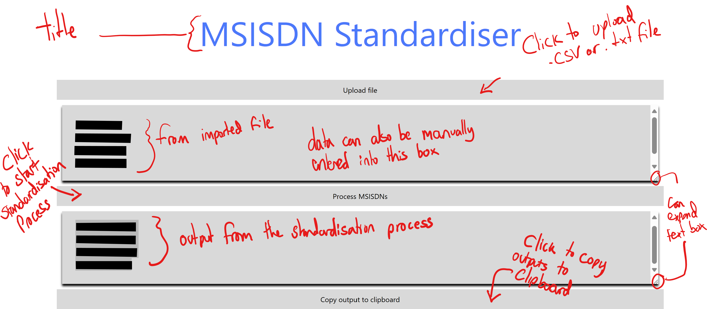

# Introduction

This Minimal Viable Product (MVP) web application will showcase the possibility of having a webapp to standardise MSISDNs (Telephone numbers) to the international E164 format (e.g. +447912345678) which is compatible with our other corporate system data standards. This is useful as we often recieve entities from sources where the entities have no common standard and thus can cause erros when checking corporate systems en-mass. This web app will ensure matching entites is done consistently with the highest chance of success and lower the rate of false negatives being hit due to inconsistent formatting.

# Table of Contents
- [`Installation`](#Installation)
- [`Usage`](#Usage)
- [`Design`](#Design)
- [`Planning`](#Planning)
- [`Minimal Viable Product (MVP) development`](#MVP_Dev)
- [`Testing`](#Testing)
- [`Contributing`](#Contributing)
- [`License`](#License)
- [`Evaluation`](#Evaluation)

# Installation
This application consists of HTML, CSS, and Javascript with static unit tests completed in a jest framework.

# Usage
The code can be run using github pages or cloning the repository in vscode and using live server extenstion to run the page.

As a user upon initialising the web app the user will be met with a home page. This home page is for the user to record their username and the task number they are working on. The user cannot progress from this page without completing both of these boxes. Currently no validation is done on what is written in those boxes, nor is it captured anywahere for the MVP.

Once the user has entered their username and relevant atsking number the user will be moved to the index page. This page allows the user to manually type out a list of new line separated MSISDNs, or click the import file button to load data from a .csv or .txt file. These file can only be single column currently. Once clicked and a file selected the data will be loaded to the input text box automatically.

Once the input box has been completed, the user needs to click the standardise button, which will take the input box data and pass it to the standardser and return the results to the output box.

From this point the user can copy the contents of the output box to a clipboard for use in other programmes.

The main page features can be seen notated here:

# Design
The requirements for the project were captured during an ideas capture meeting. This is where the product owner and key stake holders are brought together to draw up a list of key feature requirements for the project. These requirements are then catured in Github issues. These requirements indicated the user details and reason for use must be captured, followed by a way for the user to input entities for standardising, and then run the process followed by the ability to export the data.

The wire frame for the webapp was designed and prototyped in Figma. This was shown to the product owner and key stake holders, which allowed for instant feedback around the design and the flow of the web app. Initially I had designed an app with separate input and results pages. However, customer feedback from the design stage indicated this was unnecessary as they wanted to see the RAW and standardised together, but didnt want to export the RAW at the end. This allowed for a more streamlined codebase and less HTML pages. As the app becomes more complex, extra pages may be required to avoid the interface getting cluttered.

The figma prototype can be seen here:
[Figma wireframe URL] (https://www.figma.com/file/Z6HpTQU05zg2OTryS5L4AR/SA1?type=design&node-id=0%3A1&mode=design&t=X9lGazhlGBTKNXYi-1)

Below are screenshots of the prototype as designed in Figma:

The home page which the user first hits allows them to record their username and the task they are using the app for. This is for both audit and performance statistics collection purposes. i.e how much usage is the app getting and thus is it worth improving.

This is the page where the user can type in a list of new line separated MSISDNs or ingest a single columned .csv or .txt file containing entities to be standardised.

This is the output for the app, a list of standardised numbers copied to clipboard. The user can then paste these into a new system to perform a search.

# Planning
This project was being developed using an agile framework using kanban. Kanban was chosen as I did not want a time scale, as would be required for a sprint, but needed to manage the issues created via tickets on a board. Kanban also allowed me to track the Work In Progress (WIP) and ensure too many tickets weren't being brought into the 'in progress' section of the board. My issues were created into tickets whih contained a summary describing the task of the ticket, and what a 'definition of done' was so that the developer would know when the ticket was resolved. This reduces scope creep and keeps devs working only on what has been agreed. My Kanban board was on gthub projects as this allowed me to track issues an complete merge requests within the same area. Following on from the ideas session with key stakeholders the requirements they raised generated tickets which were either direct requirements or sub tasks of direct requirements, along with some 'nice to have features' which would be included if time allowed, such as exporting data as spreadsheets. All these issues were placed in the todo section of the board, ready to be pulled into 'n progress' once work commenced. 

This is how we manage work in my current work place and I believe it is very helpful for managing workloads and informing customers of the current progress of a project. We have extra swim lanes such as 'backlog' where ideas are placed, but have not yet reached a stage where work can begin. We also have peer review and customer review sections where code and the outputs are reviewed by other developers and the product owner respectively. This is only possible due to the way work is tracked by GitHub. It worked well in this project as it ensured alll customer requirements, captured at the start of the project, were implemented and the customer got a web app they wanted.

The link to my kanban board is here [Kanban board](https://github.com/users/aa2112a/projects/4)

# MVP_Dev

The Minimal Viable Product was built using the VScode IDE, using several extenstons and stored in a GitHub repo. This ensured code would be safe and that a modern IDE was used to help with standardising the code. 

To build the MVP I created an inital index.html with the basic HTML, then using the VSCode live server extension I checked that this page would load with some basic text (Shown in below Test and Trace table - Test1). I then began a .CSS file and changed the font in the body section to the font on the prototype, and again tested this using live server (Test 2). I then created a basic home page, and added text boxes and buttons as per the prototype. I then used figma's CSS extraction plug in to extract the CSS relevant to the prototype for the boxes and buttons and added this to the .CSS file under button and text-box sections. Now with the buttons and text boxes in place, the requirements told me they ahd to be filled in before the user could use the web app. Therefore I created a function for checking that both textboxes had been completed. Test were completed to ensure that the function worked as intended with user tests of one, both and no boxes being completed and ensuring errors showed when required (Tests 4-6).

Now with the MVP having all required pages and text boxes on the home page I decided it was time to start on the home page where the standardisation would take place. As a test driven approach was being taken I employed jest to run unit tests on my main function. Jest is a popular framework used to test JavaScript code (https://jestjs.io/, 2024). I created tests for the standardiseMsisdns function which would be used to standardse telephone numbers. I initially tested jest was setup correctlt (test 7) before running a basic test to standardise a telephone number. This test failed as expected as I had not yet coded the algorith to standardise the telephone numbers (Test 12).

With tests setup I decided I would first ensure the function moved numbers form the input box to the output box without manipulating them. This was to isolte the funtionality to ensure it works before adding complexity of the standardisation. To test this I added text to the import box, then clicked the process button and ensured the same text appeared in the output box.

Finally I coded the standardiseMsisdns function and re-ran the unit tests to ensure all expected outcomes passed. All unit tests are passed and standardised MSISDNs are placed in the output textbox (Test 14).

The last piece of functionality is for the user to copy the contents of the output box onto the users' clipboard to paste them elsewhere. Test 15 shows this is achieved, and that the user can standrdise numbers and export them via the clipboard.

# Testing

A test driven development approach was used throughtout the development of the MVP. 

By using a modern IDE, visual studio, static testing is completed on the go with alerts for Syntax, standards violations, and undefined values or variables. This is the foundation for my testing process during software development. For the most important function standardisingMsisdns I created a unit test with the expected results prior to writing the function. This was to ensure the function performed as required. When errors were found in the function they could be fixed immediately whilst writing the function and all possible outcomes could be captured and dealt with whilst writing the function. To perform static unit tests the jest framework was used. It’s a popular JavaScript framework which includes a runner and assertion library which are used in the unit tests. This framework allows me to group unit tests and run all the tests as part of a single group of tests. This static testing was completed alongside defensive coding of ensuring datatypes entering the functions was as expected and if not throwing an error. This ensures errors are dealt with early so as not to cause an issue later on in the function where outcomes would be less predictable for error catching. To run unit tests in jest 'npm test' was run in the terminal, whic then ran all .test.js files in the project.

To track manual testing of the code, a test and trace table has been completed to show the tests completed during development, the expected and actual outcomes and fixes deployed if required.

| Test ID | Test Description                                                                                                        | Expected Outcome                                                                                                                | Actual Outcome                                                                                                                     | Fix Deployed                                                                                                         |
|---------|-------------------------------------------------------------------------------------------------------------------------|---------------------------------------------------------------------------------------------------------------------------------|------------------------------------------------------------------------------------------------------------------------------------|----------------------------------------------------------------------------------------------------------------------|
| 1       | Initial skeleton of HTML file running on live server                                                                    | Text of ‘initial commit’ showing                                                                                                |                                                                                                       |                                                                                                                      |
| 2       | Initial skeleton of HTML file running on live server                                                                    | Text of ‘initial commit’ showing in a new font style                                                                            |                                                                                                       |                                                                                                                      |
| 3       | Add function to test both audit boxes have been completed.     Don’t complete any boxes.                                | Error message should appear                                                                                                     | No message and no navigation to index page.                                                                                        | '' Needed to be added to home.html to define where the js functions could be found. |
| 4       | Add function to test both audit boxes have been completed.     Don’t complete any boxes.                                | Error message as boxes empty                                                                                                    |                                                                                                       |                                                                                                                      |
| 5       | Add function to test both audit boxes have been completed.     complete a single box.                                   | Error message as one box is empty                                                                                               |                                                                                                       |                                                                                                                      |
| 6       | Add function to test both audit boxes have been completed.     complete both boxes.                                     | Navigation to index page with no error message                                                                                  | Navigation to index page with no error message                                                                                     |                                                                                                                      |
| 7       | Setup jest for unit tests                                                                                               | The below unit test should run and pass.                                                           |                                                                                                       |                                                                                                                      |
| 8       | Create empty function block and ensure being seen by jest                                                               | Test should pass.                                                                                  | Test failed as jest was unable to identify function.                                                  | Fix was to ensure module was exported in scripts.js to expose it for testing                                         |
| 9       | Create empty function block and ensure being seen by jest                                                               | Test should pass.                                                                                  |                                                                                                                                    |                                                                                                                      |
| 10      | Run test to ensure failure on msisdn parsing as function not yet created                                                | Function should fail as the algorithms for standardising the msisdns are not yet in place.                                      |                                                                                                     |                                                                                                                      |
| 11      | Integration testing for standardisingMsisdn function with the rest of script.js                                         | Function should fail as the algorithms for standardising the msisdns are not yet in place.                                      | Code is outside a function and not running on a web browser therefore the required parameters are out of jests scope and is raising an error | wrap code into a function or move web related listener code to a new .js file                                        |
| 12      | Integration testing for standardisingMsisdn function with the rest of script.js                                         | Function should fail as the algorithms for standardising the msisdns are not yet in place.                                      |                                                                                                     |                                                                                                                      |
| 13      | Test if when submit button is clicked variables are collected from the input box processed and output to the output box |  Function should copy the numbers to the output box as the standardise function is a shell still |                                                                                                     |                                                                                                                      |
| 14      | Test if input msisdns are standardised when submit is clicked                                                           | all msisdns appear in the output text box in a standardised form  and all unit tests should pass                                                              |                                                                                                       |                                                                                                                      |
| 15      | Test if output textbox contents are copied when copy button is clicked                                                  | I should be able to paste contents of output box to text file                                                                   |                                                                                                     |                                                                                                                      |

# Contributing
The code is held in the [repo] (https://github.com/aa2112a/aa2112a-_-SE-SumAsses1-Jan22-Cohort.git)
All updates should be made to a branch and be peer checked, tested and documentation updated prior to merging the update branch with the main branch. Direct merges to main are forbidden due to unforseen onward issues and merge conflicts causing down time for users. 

# License
No Licesnse file. Inform the Data Management Office if this code needs to be exported from the platform. 

# Evaluation
This webapp is a MVP to indicate what is possible for my work place and to highlight the ease of development with javascript, HTML and CSS over the current Python Streamlit package use for front ends. 
Using the github project and repository in tandom whilst working on the project allowed tickets and code pushes to be tied together and ensured that code was pushed whenever a ticket was resolved, and that the code in the repo was most upto date. This in real life would reduce merge conflicts and ensure all team members are working on the newest version of the code.

The test driven coding approach was also very useful as it sved having to tackle bugs identifed after  large code base has been written. It allowed me to isolate functions and test them automatically using jest, before testing their integration with the rest of the application. This ensured that I only had to test what was new and did not require me to do large investigations into bugs which had several linking features or functions. 

Given this was an MVP there were several improvemnets which could be made which were in the initial requirements list but were not required for the MVP, but would be considered for a release version of the app. Currently the home page which records username and task is not active, in the sense that data is not pushed anywhere. In the release version this data would need to be pushed to our audit record systems to monitor usage of the application.

The standardising algorith would need to be changed to use the google phonenumbers library (https://github.com/google/libphonenumber), which is used to standardise our communication entities elsewhere, but ws out of scope for this project. In my experiments the Javascript version was not as performent as the Python version already used by my team, due to it not supporting E164 format on output. Therefore, the app will need to integrate the Python version of the library which would then need to be running as an API on the back end server. This was out of scope for this MVP but can be done using an ajax request in javascript or jquery.

Other features which were out of scope but would be necesssary for future versions would be allowing for the import of multi-column csv's and spreadsheet and allowing the user to select the column to be standardised, before adding a standardised column and returning the whole dataset either as a csv/xlsx and displaying the results as table on the webpage.